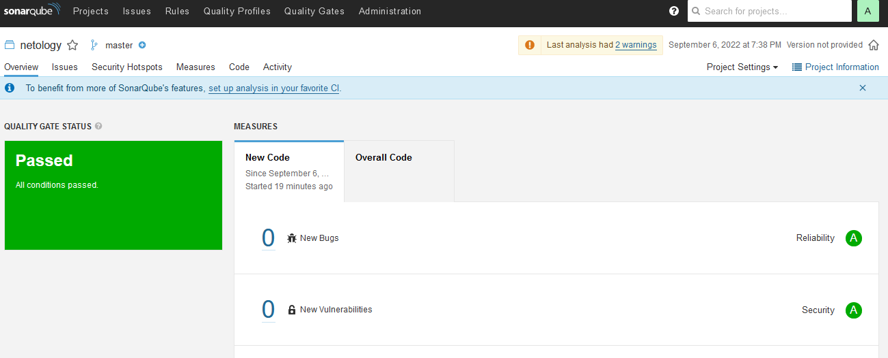

# Царьков В.В. 
# Домашнее задание к занятию "09.02 CI\CD"

Подготовка к выполнению

    Создаём 2 VM в yandex cloud со следующими параметрами: 2CPU 4RAM Centos7(остальное по минимальным требованиям)

    Прописываем в inventory playbook'a созданные хосты
    Добавляем в files файл со своим публичным ключом (id_rsa.pub). Если ключ называется иначе - найдите таску в плейбуке, которая использует id_rsa.pub имя и исправьте на своё
    Запускаем playbook, ожидаем успешного завершения
```
PLAY RECAP *************************************************************************************************************************************************************
nexus-01                   : ok=17   changed=15   unreachable=0    failed=0    skipped=2    rescued=0    ignored=0
sonar-01                   : ok=34   changed=16   unreachable=0    failed=0    skipped=1    rescued=0    ignored=0

```
    Проверяем готовность Sonarqube через браузер
    Заходим под admin\admin, меняем пароль на свой
    Проверяем готовность Nexus через бразуер
    Подключаемся под admin\admin123, меняем пароль, сохраняем анонимный доступ

# Знакомоство с SonarQube
Основная часть

    Создаём новый проект, название произвольное
```
Создали новый проект netology
```
    Скачиваем пакет sonar-scanner, который нам предлагает скачать сам sonarqube
```
root@vagrant:/vagrant/9.3_cicd# wget https://binaries.sonarsource.com/Distribution/sonar-scanner-cli/sonar-scanner-cli-4.7.0.2747-linux.zip
--2022-09-06 15:44:49--  https://binaries.sonarsource.com/Distribution/sonar-scanner-cli/sonar-scanner-cli-4.7.0.2747-linux.zip
Resolving binaries.sonarsource.com (binaries.sonarsource.com)... 13.33.243.96, 13.33.243.94, 13.33.243.70, ...
Connecting to binaries.sonarsource.com (binaries.sonarsource.com)|13.33.243.96|:443... connected.
HTTP request sent, awaiting response... 200 OK
Length: 43162003 (41M) [application/zip]
Saving to: ‘sonar-scanner-cli-4.7.0.2747-linux.zip’

sonar-scanner-cli-4.7.0.2747-linux.zip    100%[=====================================================================================>]  41.16M  10.5MB/s    in 4.4s

2022-09-06 15:44:54 (9.26 MB/s) - ‘sonar-scanner-cli-4.7.0.2747-linux.zip’ saved [43162003/43162003]

root@vagrant:/vagrant/9.3_cicd#

```
    Делаем так, чтобы binary был доступен через вызов в shell (или меняем переменную PATH или любой другой удобный вам способ)
```
export PATH=$PATH:/opt/sonar-scanner/bin
echo $PATH
/root/yandex-cloud/bin:/usr/local/sbin:/usr/local/bin:/usr/sbin:/usr/bin:/root/bin:/opt/sonar-scanner/:/opt/sonar-scanner/bin
```
    Проверяем sonar-scanner --version
```
root@vagrant:/opt/sonar-scanner# sonar-scanner --version
INFO: Scanner configuration file: /opt/sonar-scanner/conf/sonar-scanner.properties
INFO: Project root configuration file: NONE
INFO: SonarScanner 4.7.0.2747
INFO: Java 11.0.14.1 Eclipse Adoptium (64-bit)
INFO: Linux 5.4.0-125-generic amd64

```
    Запускаем анализатор против кода из директории example с дополнительным ключом -Dsonar.coverage.exclusions=fail.py
```
sonar-scanner \
  -Dsonar.projectKey=netology \
  -Dsonar.sources=. \
  -Dsonar.host.url=http://130.193.37.147:9000 \
  -Dsonar.login=8646665edcb79367849f7488c8bf0a5941f72afa
```
    Смотрим результат в интерфейсе

    Исправляем ошибки, которые он выявил(включая warnings)
```
root@vagrant:/vagrant/9.3_cicd/example# cat fail.py
def increment(index):
    return index + 1
def get_square(numb):
    return numb*numb
def print_numb(numb):
    print("Number is {}".format(numb))
index = 0
while (index < 10):
    index = increment(index)
    print(get_square(index))
```
    Запускаем анализатор повторно - проверяем, что QG пройдены успешно
    Делаем скриншот успешного прохождения анализа, прикладываем к решению ДЗ


Знакомство с Nexus
Основная часть

    В репозиторий maven-releases загружаем артефакт с GAV параметрами:
        groupId: netology
        artifactId: java
        version: 8_282
        classifier: distrib
        type: tar.gz
    В него же загружаем такой же артефакт, но с version: 8_102
    Проверяем, что все файлы загрузились успешно

    В ответе присылаем файл maven-metadata.xml для этого артефекта
[maven-metadata.xml](image/maven-metadata.xml)

Знакомство с Maven
Подготовка к выполнению

    Скачиваем дистрибутив с maven
```
wget https://dlcdn.apache.org/maven/maven-3/3.8.6/binaries/apache-maven-3.8.6-bin.zip
```
    Разархивируем, делаем так, чтобы binary был доступен через вызов в shell (или меняем переменную PATH или любой другой удобный вам способ)
```
ln -s /opt/maven/bin/mvn /usr/bin/mvn
chmod ugo+x /usr/bin/mvn
```
    Удаляем из apache-maven-<version>/conf/settings.xml упоминание о правиле, отвергающем http соединение( раздел mirrors->id: my-repository-http-blocker)
    Проверяем mvn --version
```
root@vagrant:/opt/maven# mvn -v
Apache Maven 3.8.6 (84538c9988a25aec085021c365c560670ad80f63)
Maven home: /opt/maven
Java version: 1.8.0_342, vendor: Private Build, runtime: /usr/lib/jvm/java-8-openjdk-amd64/jre
Default locale: en_US, platform encoding: UTF-8
OS name: "linux", version: "5.4.0-125-generic", arch: "amd64", family: "unix"
```
    Забираем директорию mvn с pom

Основная часть

    Меняем в pom.xml блок с зависимостями под наш артефакт из первого пункта задания для Nexus (java с версией 8_282)
```
root@vagrant:/vagrant/9.3_cicd/mvn# cat pom.xml
<project xmlns="http://maven.apache.org/POM/4.0.0" xmlns:xsi="http://www.w3.org/2001/XMLSchema-instance"
  xsi:schemaLocation="http://maven.apache.org/POM/4.0.0 http://maven.apache.org/xsd/maven-4.0.0.xsd">
  <modelVersion>4.0.0</modelVersion>

  <groupId>com.netology.app</groupId>
  <artifactId>simple-app</artifactId>
  <version>1.0-SNAPSHOT</version>
   <repositories>
    <repository>
      <id>my-repo</id>
      <name>maven-public</name>
      <url>http://51.250.12.133:8081/repository/maven-public/</url>
    </repository>
  </repositories>
  <dependencies>
     <dependency>
      <groupId>netology</groupId>
      <artifactId>java</artifactId>
      <version>8_282</version>
      <classifier>distrib</classifier>
      <type>tar.gz</type>
    </dependency> -->
  </dependencies>
</project>
```
    Запускаем команду mvn package в директории с pom.xml, ожидаем успешного окончания
```
[INFO] Building jar: /vagrant/9.3_cicd/mvn/target/simple-app-1.0-SNAPSHOT.jar
[INFO] ------------------------------------------------------------------------
[INFO] BUILD SUCCESS
[INFO] ------------------------------------------------------------------------
[INFO] Total time:  41.227 s
[INFO] Finished at: 2022-09-06T17:51:32Z
[INFO] ------------------------------------------------------------------------
```
    Проверяем директорию ~/.m2/repository/, находим наш артефакт
```
root@vagrant:/vagrant/9.3_cicd/mvn# ls -ls ~/.m2/repository/netology/java/8_282/
total 20
8 -rw-r--r-- 1 root root 4537 Sep  6 17:50 java-8_282-distrib.tar.gz
4 -rw-r--r-- 1 root root   40 Sep  6 17:50 java-8_282-distrib.tar.gz.sha1
4 -rw-r--r-- 1 root root  731 Sep  6 17:50 java-8_282.pom.lastUpdated
4 -rw-r--r-- 1 root root  175 Sep  6 17:50 _remote.repositories
```
    В ответе присылаем исправленный файл pom.xml
```
root@vagrant:/vagrant/9.3_cicd/mvn# cat pom.xml
<project xmlns="http://maven.apache.org/POM/4.0.0" xmlns:xsi="http://www.w3.org/2001/XMLSchema-instance"
  xsi:schemaLocation="http://maven.apache.org/POM/4.0.0 http://maven.apache.org/xsd/maven-4.0.0.xsd">
  <modelVersion>4.0.0</modelVersion>

  <groupId>com.netology.app</groupId>
  <artifactId>simple-app</artifactId>
  <version>1.0-SNAPSHOT</version>
   <repositories>
    <repository>
      <id>my-repo</id>
      <name>maven-public</name>
      <url>http://51.250.12.133:8081/repository/maven-public/</url>
    </repository>
  </repositories>
  <dependencies>
     <dependency>
      <groupId>netology</groupId>
      <artifactId>java</artifactId>
      <version>8_282</version>
      <classifier>distrib</classifier>
      <type>tar.gz</type>
    </dependency>
  </dependencies>
</project>

```
