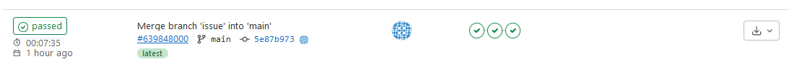
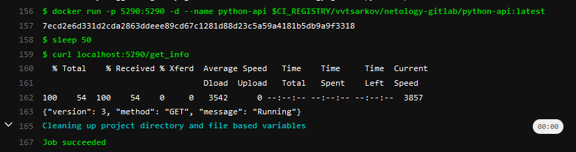

# Царьков В.В.
# Домашнее задание к занятию "09.05 Gitlab"
Подготовка к выполнению

    Необходимо зарегистрироваться
    Создайте свой новый проект
- Сделали [Проект](https://gitlab.com/VVTsarkov/netology-gitlab)
    Создайте новый репозиторий в gitlab, наполните его файлами
    Проект должен быть публичным, остальные настройки по желанию

Основная часть
DevOps

В репозитории содержится код проекта на python. Проект - RESTful API сервис. Ваша задача автоматизировать сборку образа с выполнением python-скрипта:

    Образ собирается на основе centos:7
    Python версии не ниже 3.7
    Установлены зависимости: flask flask-jsonpify flask-restful
    Создана директория /python_api
    Скрипт из репозитория размещён в /python_api
    Точка вызова: запуск скрипта
    Если сборка происходит на ветке master: Образ должен пушится в docker registry вашего gitlab python-api:latest, иначе этот шаг нужно пропустить
	
+ Собрали образ как и требовалось.
+ Первичный файл .gitlab-ci.yml:
```
image: docker:latest
services:
    - docker:dind
stages:
  - build
  - test
  - deploy

docker-build:
  stage: build
  script:
    - docker login -u "$CI_REGISTRY_USER" -p "$CI_REGISTRY_PASSWORD" $CI_REGISTRY
    - docker build --pull -t $CI_REGISTRY/vvtsarkov/netology-gitlab/python-api:latest .
  rules:
    - if: $CI_COMMIT_BRANCH
      exists:
        - Dockerfile

docker-deploy:
  stage: deploy
  script:
    - docker login -u "$CI_REGISTRY_USER" -p "$CI_REGISTRY_PASSWORD" $CI_REGISTRY
    - docker build --pull -t $CI_REGISTRY/vvtsarkov/netology-gitlab/python-api:latest . 
    - docker push $CI_REGISTRY/vvtsarkov/netology-gitlab/python-api:latest
  only:
    - main
```

Product Owner

Вашему проекту нужна бизнесовая доработка: необходимо поменять JSON ответа на вызов метода GET /rest/api/get_info, необходимо создать Issue в котором указать:

    Какой метод необходимо исправить
    Текст с { "message": "Already started" } на { "message": "Running"}
    Issue поставить label: feature
	
- Issue создали [Issue](https://gitlab.com/VVTsarkov/netology-gitlab/-/issues/2)

Developer

Вам пришел новый Issue на доработку, вам необходимо:

    Создать отдельную ветку, связанную с этим issue
    Внести изменения по тексту из задания
    Подготовить Merge Requst, влить необходимые изменения в master, проверить, что сборка прошла успешно

```yaml
  image: docker:latest
services:
    - docker:dind
stages:
  - build
  - test
  - deploy

docker-build:
  stage: build
  script:
    - docker login -u "$CI_REGISTRY_USER" -p "$CI_REGISTRY_PASSWORD" $CI_REGISTRY
    - docker build --pull -t $CI_REGISTRY/vvtsarkov/netology-gitlab/python-api:latest .
  rules:
    - if: $CI_COMMIT_BRANCH
      exists:
        - Dockerfile

docker-test:
  stage: test
  script:
    - docker login -u "$CI_REGISTRY_USER" -p "$CI_REGISTRY_PASSWORD" $CI_REGISTRY
    - docker build --pull -t $CI_REGISTRY/vvtsarkov/netology-gitlab/python-api:latest .
    - docker run -p 5290:5290 -d --name python-api $CI_REGISTRY/vvtsarkov/netology-gitlab/python-api:latest
    - sleep 50
    - curl localhost:5290/get_info

docker-deploy:
  stage: deploy
  needs:
    - docker-test
  script:
    - docker login -u "$CI_REGISTRY_USER" -p "$CI_REGISTRY_PASSWORD" $CI_REGISTRY
    - docker build --pull -t $CI_REGISTRY/vvtsarkov/netology-gitlab/python-api:latest . 
    - docker push $CI_REGISTRY/vvtsarkov/netology-gitlab/python-api:latest
  only:
    - main 
```
```py
from flask import Flask, request
from flask_restful import Resource, Api
from json import dumps
from flask_jsonpify import jsonify

app = Flask(__name__)
api = Api(app)

class Info(Resource):
    def get(self):
        return {'version': 3, 'method': 'GET', 'message': 'Running'}

api.add_resource(Info, '/get_info')

if __name__ == '__main__':
     app.run(host='0.0.0.0', port='5290')
```
  - Сборка прошла успешно

  - Проверка в job тоже прошла успешно


Tester

Разработчики выполнили новый Issue, необходимо проверить валидность изменений:

    Поднять докер-контейнер с образом python-api:latest и проверить возврат метода на корректность
    Закрыть Issue с комментарием об успешности прохождения, указав желаемый результат и фактически достигнутый
	
```
[root@localhost ~]# docker images
REPOSITORY                                                 TAG       IMAGE ID       CREATED         SIZE
registry.gitlab.com/vvtsarkov/netology-gitlab/python-api   latest    5df8fba883a4   2 hours ago     443MB

[root@localhost ~]# docker ps
CONTAINER ID   IMAGE                                                             COMMAND                  CREATED       STATUS       PORTS                                       NAMES
7ecd2e6d331d   registry.gitlab.com/vvtsarkov/netology-gitlab/python-api:latest   "python3 /python_api…"   2 hours ago   Up 2 hours   0.0.0.0:5290->5290/tcp, :::5290->5290/tcp   python-api

[root@localhost ~]# curl localhost:5290/get_info
{"version": 3, "method": "GET", "message": "Running"}
```

Итог

После успешного прохождения всех ролей - отправьте ссылку на ваш проект в гитлаб, как решение домашнего задания

[Project](https://gitlab.com/VVTsarkov/netology-gitlab)
